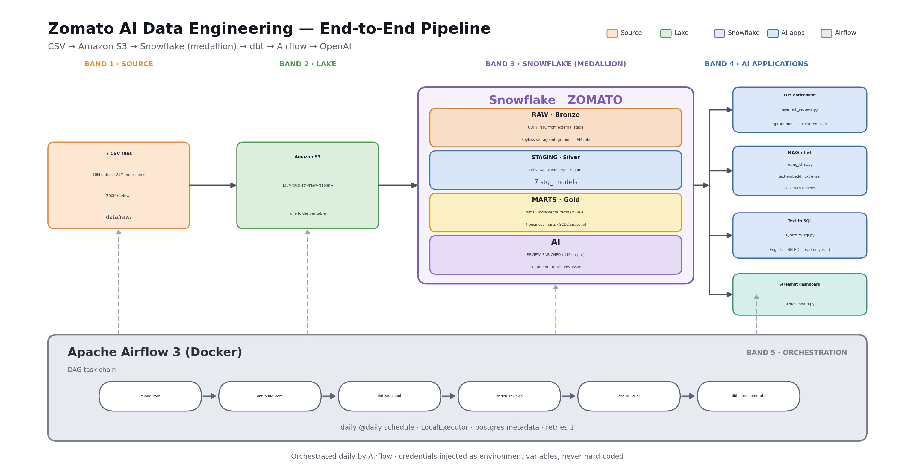

# AI Data Platform

A complete batch data pipeline that takes Zomato-style food-delivery data from
raw CSVs all the way to AI-powered analytics:

**Zomato/Food-Delivery Dataset → Amazon S3 → Snowflake → dbt → Airflow → AI (OpenAI)**

The dataset lands in an S3 data lake and flows into Snowflake through a keyless
storage integration, where dbt transforms it through medallion layers — **RAW**
(Bronze) tables loaded via `COPY INTO`, cleaned **STAGING** (Silver) views, and
business-ready **MARTS** (Gold) with dimensions, incremental facts, SCD2 history
and aggregate marts. Apache Airflow orchestrates the whole thing as one daily DAG.

On top of the warehouse sits an AI lane: LLM enrichment turns free-text reviews
into structured, queryable columns; RAG lets you chat with your reviews;
text-to-SQL lets you query the warehouse in plain English; and a Streamlit
dashboard serves the marts. Every AI app that *reads* the warehouse does so as a
**read-only role**; the enrichment job is the only one that writes, and the only
one that needs a role which can.



---

## What gets built

| Layer | Where | What |
|---|---|---|
| **Source** | `data/raw/` | 4 messy dimension CSVs (restaurants, users, food, menu) + 3 generated fact files: **10M orders**, **~23M order items**, **300K free-text reviews** |
| **Lake** | Amazon S3 | One bucket, `raw/<table>/` — one prefix per CSV |
| **Bronze** | Snowflake `ZOMATO.RAW` | `COPY INTO` from S3 via a **keyless** storage integration + IAM role |
| **Silver** | Snowflake `ZOMATO.STAGING` | 7 dbt staging views — clean, type and rename every source |
| **Gold** | Snowflake `ZOMATO.MARTS` | 4 dimensions, **incremental** facts (MERGE), 4 business marts, plus an SCD2 snapshot |
| **AI** | Snowflake `ZOMATO.AI` | LLM-enriched reviews (sentiment/topic/key issue), RAG chat, text-to-SQL |
| **Orchestration** | Airflow 3 (Docker) | One daily DAG: load → transform → snapshot → enrich → AI mart → docs |

### Tech stack

Python · Pandas · Amazon S3 · Snowflake · dbt (dbt-snowflake 1.8) · Apache Airflow 3 (Docker) · OpenAI (`gpt-4o-mini`, `text-embedding-3-small`) · Streamlit

---

## Quickstart

Five commands, once the [RUNBOOK](RUNBOOK.md) has walked you through the AWS and
Snowflake setup:

```bash
make install                     # Python dependencies
make data-small                  # tiny dataset — or `make data` for the full 10M rows

make upload                      # CSVs -> s3://<bucket>/raw/
make verify-s3                   # did it all actually arrive?

make pipeline                    # dbt build -> snapshot -> enrich -> dbt build tag:ai
make airflow-up                  # http://localhost:8080  (admin / admin)
```

Then explore:

```bash
make dashboard                   # operations dashboard over the Gold marts
make rag                         # chat with your reviews (RAG)
make text2sql                    # chat with your warehouse (text-to-SQL)
make docs                        # dbt docs: lineage, tests, exposures
make check                       # offline consistency checks (~1 second)
```

`make` on its own lists every target.

> **Only two things are required before `make pipeline` works:** the Snowflake
> objects from `snowflake/01`–`04`, and the S3 bucket plus IAM role from
> `aws/iam/`. [RUNBOOK.md](RUNBOOK.md) covers both, including the two mistakes
> everybody makes on the Snowflake ↔ IAM trust handshake.

---

## Repository structure

```
├── RUNBOOK.md                    # zero-to-running setup, with real error messages
├── Makefile                      # every entry point, discoverable via `make`
│
├── data/
│   ├── generator/                # reproducible dataset: dimensions + 10M facts
│   └── README.md                 # or bring the original CSVs instead
├── ingestion/
│   ├── upload_to_s3.py           # multipart upload, mirrors the lake layout
│   └── verify_s3.py              # both-directions lake/local diff; exits non-zero
│
├── snowflake/                    # run in Snowsight, in order
│   ├── 01_setup.sql              #   warehouse, database, schemas, DBT_ROLE, ZOMATO_AI_RO
│   ├── 02_storage_integration.sql#   keyless S3 link
│   ├── 03_stage_and_formats.sql  #   external stage + CSV file format
│   ├── 04_raw_tables.sql         #   Bronze DDL (column order = the CSV contract)
│   ├── 05_copy_into.sql          #   load, with strict/tolerant error modes
│   └── 06_grants_and_monitoring.sql # cost guard, read-only role, health views
├── aws/iam/                      # the S3 ↔ Snowflake handshake, as JSON
│
├── zomato/                       # the dbt project
│   ├── profiles.yml              #   committed, but 100% env-var driven
│   ├── models/staging/           #   Silver: 7 views + sources + tests
│   ├── models/marts/             #   Gold: dims, incremental facts, marts, exposures
│   ├── snapshots/                #   SCD2 history for dim_restaurants
│   ├── tests/                    #   singular tests for cross-column invariants
│   └── analyses/                 #   ad-hoc SQL that compiles but never materialises
│
├── ai/
│   ├── common.py                 # shared Snowflake + OpenAI clients (password or key-pair)
│   ├── enrich_reviews.py         # LLM as a transformation step
│   ├── rag_chat.py               # chat with your reviews
│   ├── text_to_sql.py            # chat with your warehouse
│   └── dashboard.py              # Streamlit dashboard over the marts
│
├── airflow/                      # Airflow 3 on Docker
│   ├── Dockerfile                #   Snowflake + FAB providers; dbt in its own venv
│   ├── docker-compose.yaml       #   postgres + api-server + scheduler + dag-processor
│   └── dags/zomato_batch.py      #   the 6-task daily DAG
│
├── scripts/check_project.py      # offline consistency checks used by CI
├── docs/architecture.md          # design rationale
└── .github/workflows/ci.yml      # lint, generator smoke test, dbt parse, docker build
```

---

## How the pipeline works

### 1 · Data lands in S3

Seven CSVs are uploaded to `s3://<BUCKET>/raw/<table>/` — one prefix per table. The
local tree under `data/raw/` mirrors the lake exactly, so publishing is a straight
recursive upload. `verify_s3.py` then diffs both directions and exits non-zero on a
missing file, a stale extra object, or a size mismatch.

### 2 · S3 → Snowflake: one keyless handshake

Snowflake reads the bucket with **no stored keys**, using a storage integration plus
an IAM role. The Snowflake side is
[`snowflake/02_storage_integration.sql`](snowflake/02_storage_integration.sql); the
AWS documents live in [`aws/iam/`](aws/iam/):

| File | Used for |
|---|---|
| [`s3-read-policy.json`](aws/iam/s3-read-policy.json) | IAM policy `zomato-s3-read` — read-only, scoped to `<BUCKET>/raw/*` |
| [`snowflake-role-trust-policy-initial.json`](aws/iam/snowflake-role-trust-policy-initial.json) | Placeholder trust, used only so the role can be created |
| [`snowflake-role-trust-policy-final.json`](aws/iam/snowflake-role-trust-policy-final.json) | Final trust — Snowflake's IAM **user** ARN + external ID from `DESC INTEGRATION` |

Order matters: create the policy and role → create the `STORAGE INTEGRATION` with the
role ARN → `DESC INTEGRATION` for `STORAGE_AWS_IAM_USER_ARN` and
`STORAGE_AWS_EXTERNAL_ID` → paste both into the role's trust policy.

Two hard-won lessons, both in the runbook: the trust `Principal` must be Snowflake's
IAM **user** ARN and not `:root`; and never re-run `CREATE OR REPLACE` on an existing
integration, because it regenerates the external ID and breaks the trust you just wired up.

### 3 · Load — `COPY INTO`

Bronze DDL ([`snowflake/04_raw_tables.sql`](snowflake/04_raw_tables.sql)) matches each
CSV's column order, then [`snowflake/05_copy_into.sql`](snowflake/05_copy_into.sql)
pulls each file from the stage. Loads are **strict** for the generated facts
(`ABORT_STATEMENT` — a parse error there means the generator is broken) and
**tolerant** for the messy dimensions (`CONTINUE` — a malformed restaurant rating is
just Tuesday, and `VALIDATE()` shows you what was skipped).

Re-running is free: Snowflake remembers which files it has already loaded.

### 4 · Transform — dbt (medallion)

- **Staging (Silver)** — one view per source, and the *only* place that knows the
  source is dirty: `'--'` → null, `'₹ 200'` → `200`, `'Koramangala, Bangalore'` →
  `'Bangalore'`, `'M'` → `'Male'`. The city normalisation is a shared `clean_city()`
  macro, because `stg_restaurants.city` and `stg_orders.city` must match
  character-for-character or the city marts silently split one city in two.
- **Dimensions (Gold)** — `dim_restaurants` (deduped), `dim_customer` (age segments),
  `dim_food`, and a generated `dim_date` calendar built with Snowflake's `GENERATOR`.
- **Facts (Gold, incremental)** — `fct_orders` (10M) and `fct_order_items` (~23M) use
  `materialized='incremental'` with a MERGE strategy, so a re-run processes only new
  rows instead of rebuilding 33M.
- **Marts (Gold)** — `mart_daily_city_revenue` (GMV/AOV/cancel rate),
  `mart_delivery_sla` (p50/p90/late rate by city and hour),
  `mart_restaurant_performance`, `mart_review_insights`.
- **SCD2** — `snapshots/dim_restaurants_snapshot.sql` keeps the history an incremental
  model cannot: what a restaurant's rating was *at the time*.
- **Tests** — ~60 generic tests (`unique`, `not_null`, `relationships`,
  `accepted_values`) plus 7 singular tests, including the headline
  `assert_order_items_reconcile_to_orders`: every order's stored totals must agree
  with the line items actually sold.

### 5 · Orchestrate — Airflow

One daily DAG, [`zomato_batch`](airflow/dags/zomato_batch.py):

```
reload_raw → dbt_build_core → dbt_snapshot → enrich_reviews → dbt_build_ai → dbt_docs_generate
(COPY INTO)   (dbt build        (SCD2)         (OpenAI)         (dbt build        (docs site)
               --exclude tag:ai)                                 --select tag:ai)
               --exclude snapshot
```

The split is not cosmetic. `mart_review_insights` reads a table that does not exist
until the AI job has run, so `dbt build --exclude tag:ai` has to come first — and the
tests on that model are tagged `ai` so they are skipped too. Without that tag the very
first pipeline run fails, not on a data problem, but because dbt tries to test a table
that has not been created yet.

Credentials never touch the code: docker-compose injects `SNOWFLAKE_*` (read by dbt's
`profiles.yml` via `env_var()`) and an `AIRFLOW_CONN_SNOWFLAKE_DEFAULT` connection.

### 6 · AI layer — four capabilities

1. **LLM enrichment** ([`ai/enrich_reviews.py`](ai/enrich_reviews.py)) — *LLM as a
   transformation step.* Reads review text, asks `gpt-4o-mini` for structured JSON
   (sentiment, score, topic, key issue), validates it against the allowed label sets,
   and writes it to `ZOMATO.AI.REVIEW_ENRICHED` — which dbt then models into
   `mart_review_insights` like any other table. Idempotent (only un-enriched reviews are
   fetched), sample-capped (`SAMPLE_N`), concurrent, and retried with backoff.
2. **RAG** ([`ai/rag_chat.py`](ai/rag_chat.py)) — *chat with your reviews.* Embeds
   reviews, retrieves the nearest neighbours for a question with two matrix ops, and
   answers grounded only in those reviews, showing you which ones it used.
3. **Text-to-SQL** ([`ai/text_to_sql.py`](ai/text_to_sql.py)) — *chat with your
   warehouse.* The model is given the marts' schema introspected live from
   `INFORMATION_SCHEMA`, writes Snowflake SQL, and a guard (comments stripped, single
   statement, `SELECT`/`WITH` only, no DDL/DML keywords, enforced row cap) validates it
   before it runs as the **read-only** `ZOMATO_AI_RO` role.
4. **Dashboard** ([`ai/dashboard.py`](ai/dashboard.py)) — the fixed BI layer: GMV trend,
   SLA heatmap, restaurant leaderboard, LLM review insights.

---

## What makes this more than a tutorial

**The AI output is a testable table, not a chat log.** Because enrichment writes to
`ZOMATO.AI.REVIEW_ENRICHED` and dbt declares it as a source, the LLM's output is
covered by `accepted_values` tests, is joinable, is versioned, and can be re-modelled
without re-calling the API. A hallucinated topic fails the build instead of quietly
reaching a dashboard.

**Text-to-SQL is defended twice.** The generated-SQL guard is the *second* line of
defence; the first is a database role that only holds `SELECT`. A prompt injection
that defeats the regex still hits a wall in Snowflake. The runbook shows you the
`CREATE TABLE` that must fail.

**Dimension keys warn, dimension models error.** Raw exports can legitimately repeat a
`restaurant_id`, so uniqueness at staging is `severity: warn`. The dedupe happens in
`dim_restaurants`, and *that* uniqueness is an error. The strictness is placed where
the guarantee is actually made.

**The project is dependency-free.** There is no `packages.yml` and no `dbt deps` step:
the calendar uses Snowflake's `GENERATOR`, and the one
"unique-combination-of-columns" check that would normally come from `dbt_utils` is
written by hand in [`zomato/tests/`](zomato/tests). One less thing to break on a fresh
clone, and one less version conflict in the Airflow image.

**CI runs without any cloud credentials.** `dbt parse` validates the whole project
offline; the generator produces a small dataset; `scripts/check_project.py` then
verifies that every YAML and JSON file parses, that every `ref()` and `source()`
resolves, that every declared source is really created by the SQL or Python that is
supposed to create it, and that each CSV's header row matches its `RAW` table's column
order. That last check is what catches generator/DDL drift before `COPY INTO` loads
rupee costs into a rating column.

---

## Differences from the original reference project

This started from
[`darshilparmar/zomato-ai-data-engineering-end-to-end-project`](https://github.com/darshilparmar/zomato-ai-data-engineering-end-to-end-project)
and was completed. The architecture, tables, marts, DAG shape and AI patterns are the
same. What changed:

**Bugs fixed**

| # | Fix |
|---|---|
| 1 | `stg_reviews.sql` had a trailing comma before `FROM` — a syntax error that made the model uncompilable |
| 2 | `stg_reviews` joined a `STRING` restaurant id to a `NUMBER` one; both sides are now cast explicitly |
| 3 | `mart_review_insights` joined the AI table's `STRING` review id with `USING` against a `NUMBER` column; now cast with `try_to_number` so a malformed id cannot fail the model |
| 4 | `dbt_project.yml` configured `snapshot:` (singular), which dbt ignores — snapshots were silently landing in the wrong schema. Now `snapshots:` with `+target_schema` |
| 5 | `mart_daily_city_revenune` → `mart_daily_city_revenue` (typo was in the model name, the file name and the text-to-SQL schema description) |
| 6 | `dim_customer` checked `age < 25` before `age is null`. It happened to work because null comparisons are never true, but it read like a bug — the null branch now comes first |
| 7 | `users.gender` mixing `Male`/`male`/`M` is normalised, so `accepted_values` and BI group-bys actually line up |

**Gaps filled**

| # | Addition |
|---|---|
| 8 | `profiles.yml` — the original README said "dbt's profiles.yml" but no such file existed |
| 9 | A reproducible data generator (the original facts were generated by scripts that were never committed; the dimensions came from a Google Drive link) |
| 10 | `snapshots/`, `tests/`, `analyses/` and `seeds/` were empty `.gitkeep` placeholders — now a real SCD2 snapshot, 7 singular tests and 2 analyses |
| 11 | `governance`: a `ZOMATO_AI_RO` read-only role. The original ran text-to-SQL as `DBT_ROLE`, which holds write access |
| 12 | DAG gained `dbt_snapshot` (because there is now a snapshot to run) and `dbt_docs_generate` |
| 13 | `snowflake/06_grants_and_monitoring.sql`, `ZOMATO.ADMIN` health views, a resource monitor and a statement timeout |
| 14 | `ingestion/` upload + verify scripts, a `Makefile`, `RUNBOOK.md` (the original README linked to a `RUNBOOK.md` that did not exist), `docs/architecture.md`, a real architecture diagram and a CI workflow |
| 15 | `mart_delivery_sla` gained `avg`, `worst`, `late_orders` and `late_rate`; `mart_restaurant_performance` gained `cancel_rate` and `aov` — the text-to-SQL schema description referenced columns that did not exist |
| 16 | Removed the unused `ZOMATO.BRONZE` schema, a leftover from a Spark/Iceberg path that is not part of this project |

**Naming changes** (documented rather than silent)

* `fact_order_items` → `fct_order_items`, to match `fct_orders`
* `stg_food.f_id` → `food_id`, and `stg_order_items.f_id` → `food_id`

---

## Cost

Ballpark for one full run at default scale, so nothing surprises you:

| Item | Cost |
|---|---|
| S3 storage | ~2.3 GB ≈ **$0.05/month** |
| Snowflake | XSMALL, a few hours of build time on a trial ≈ **a few credits** |
| OpenAI enrichment | 300K reviews is the expensive end; `SAMPLE_N=25` is **fractions of a cent** |
| OpenAI RAG | embedding 500 reviews ≈ **$0.001**; a question costs a fraction of a cent |
| Airflow | local Docker, free |

The cost controls are deliberate and in the repo: the warehouse auto-suspends after
60s, a resource monitor suspends it at 50 credits, a 1-hour statement timeout stops a
runaway query, `SAMPLE_N` caps enrichment spend per run, and the text-to-SQL app wraps
anything without a `LIMIT` in an outer one.

---

## Documentation

| Document | Contents |
|---|---|
| [RUNBOOK.md](RUNBOOK.md) | Zero-to-running setup and a troubleshooting table of real error messages |
| [docs/architecture.md](docs/architecture.md) | Why each layer exists, and the failure behaviour of every stage |
| [zomato/README.md](zomato/README.md) | The dbt project: conventions, model reference, two-phase build |
| [ingestion/README.md](ingestion/README.md) | Upload and verification, and why `upload_file` not `put_object` |
| [data/generator/README.md](data/generator/README.md) | Generating the dataset, or bringing your own |
